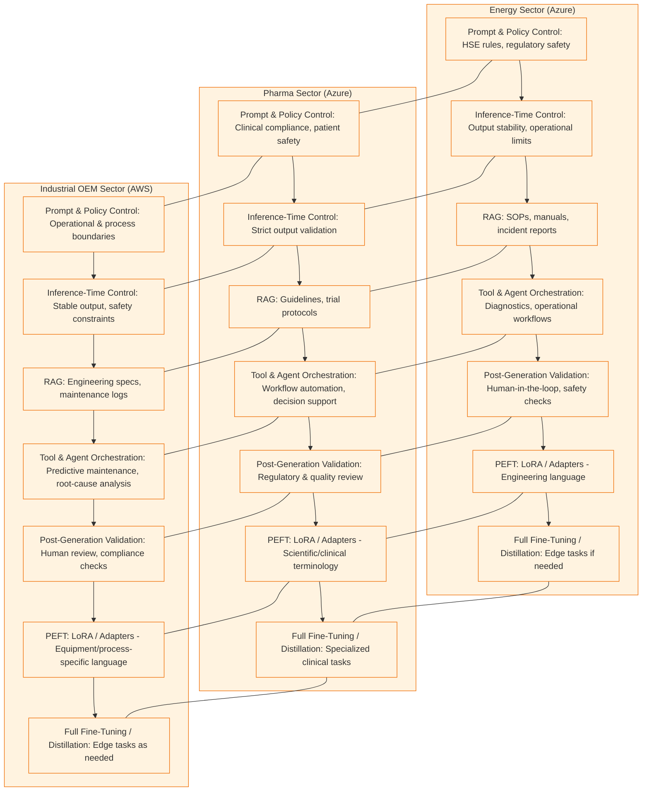

## Azure ML Workflow (Mermaid Diagram)

```mermaid
graph TD
  A[Data Ingestion] --> B[Feature Engineering]
  B --> C[Azure ML Experiment Tracking]
  C --> D[Model Training (TFT, LLM, RAG)]
  D --> E[Model Deployment (Azure ML Endpoint)]
  E --> F[Monitoring & Drift Detection]
  D --> G[Model Cards & Versioning]
  D --> H[Databricks Feature Store]
  F --> I[Automated Retraining]

  subgraph "Azure OpenAI"
    D
  end
```
# Enterprise AI Layered Adaptation (Global Context)

# Enterprise AI Layered Adaptation (Global Context)

This diagram illustrates a global, sector-specific approach to enterprise AI adaptation across Energy, Pharma, and Industrial domains. Each sector is represented as a swimlane, with layers flowing top-down to show the progression from prompt and policy control through to fine-tuning and distillation. The diagram highlights how each sector can leverage a single cloud platform (e.g., Azure for Energy and Pharma, AWS for Industrial) while sharing common architectural patterns and adaptation strategies. Horizontal links indicate shared concepts and best practices across sectors, while vertical flows show the recommended order of adaptation layers for robust, compliant, and domain-optimized AI deployment.


# energy-ai-azure

    

## Problem Statement

Energy companies face unique challenges in production forecasting, supply chain optimization, and leveraging AI at scale. This portfolio demonstrates advanced Azure ML and Azure OpenAI workflows for the energy sector, targeting enterprise AI, foundation models, and MLOps best practices.

## Architecture

```mermaid
graph TD
    A[Data Ingestion] --> B[Feature Engineering]
    B --> C[Azure ML Experiment Tracking]
    C --> D[Model Training (TFT, LLM, RAG)]
    D --> E[Model Deployment (Azure ML Endpoint)]
    E --> F[Monitoring & Drift Detection]
    D --> G[Model Cards & Versioning]
    D --> H[Databricks Feature Store]
    F --> I[Automated Retraining]
    subgraph Azure OpenAI
      D
    end
```

## Quick Start

1. **Azure Setup**: See [docs/AZURE_SETUP.md](docs/AZURE_SETUP.md)
2. **Local Testing**: Clone repo, install dependencies (`pip install -r requirements.txt`), run notebooks in `notebooks/`
3. **Experiment Tracking**: Configure Azure ML workspace, run forecasting notebook
4. **LLM Fine-tuning**: Use LoRA scripts in `models/energy_llm/`
5. **RAG Demo**: Run RAG notebook with Azure OpenAI and ChromaDB

## Notebooks
- [01_production_forecasting_azureml.ipynb](notebooks/01_production_forecasting_azureml.ipynb): Oil well production forecasting with TFT, Azure ML logging, deployment, drift detection
- [02_energy_llm_lora_finetuning.ipynb](notebooks/02_energy_llm_lora_finetuning.ipynb): LLM fine-tuning (LoRA, QLoRA) on energy text, deployment, evaluation
- [03_rag_azure_openai_energy.ipynb](notebooks/03_rag_azure_openai_energy.ipynb): RAG for energy Q&A, Azure OpenAI embeddings, ChromaDB, cost tracking

## Why This Matters for Chevron
- Demonstrates scalable, reproducible AI/ML workflows for energy
- Transferable to production forecasting, supply chain, and document intelligence
- Aligns with Chevron’s focus on enterprise AI, MLOps, and foundation models

## Expanded Modules (Chevron Enterprise AI)

- **Seismic Imaging & Subsurface Modeling**: Deep learning for seismic, well log, and reservoir simulation data
- **Predictive Maintenance**: Equipment failure prediction, anomaly detection, sensor analytics
- **Robotics & Automation**: AI for robotics, field inspection, and safety monitoring
- **Emissions Monitoring & Optimization**: GHG tracking, carbon intensity, regulatory analytics
- **Energy Trading & Price Forecasting**: Market data, price prediction, risk optimization
- **Well Placement & Drilling Optimization**: Drilling path optimization, real-time analytics
- **Document Intelligence**: Automated parsing, search, and summarization of technical documents
- **Digital Twin & Asset Performance**: Real-time asset modeling, digital twin analytics
- **Human-in-the-Loop AI**: Decision support, expert feedback, active learning
- **Safety Incident Prediction & Analytics**: HSE analytics, near-miss detection, safety modeling

## Additional Data Sources
- Seismic and well log data (SEG-Y, LAS)
- IoT sensor streams (pressure, temperature, vibration)
- Maintenance logs and work orders
- Satellite and drone imagery
- SCADA data
- Market and trading data
- Technical documents (PDFs, reports, manuals)
- Environmental and regulatory data

---

For details, see [docs/ARCHITECTURE.md](docs/ARCHITECTURE.md) and [docs/MODEL_LIFECYCLE.md](docs/MODEL_LIFECYCLE.md).
